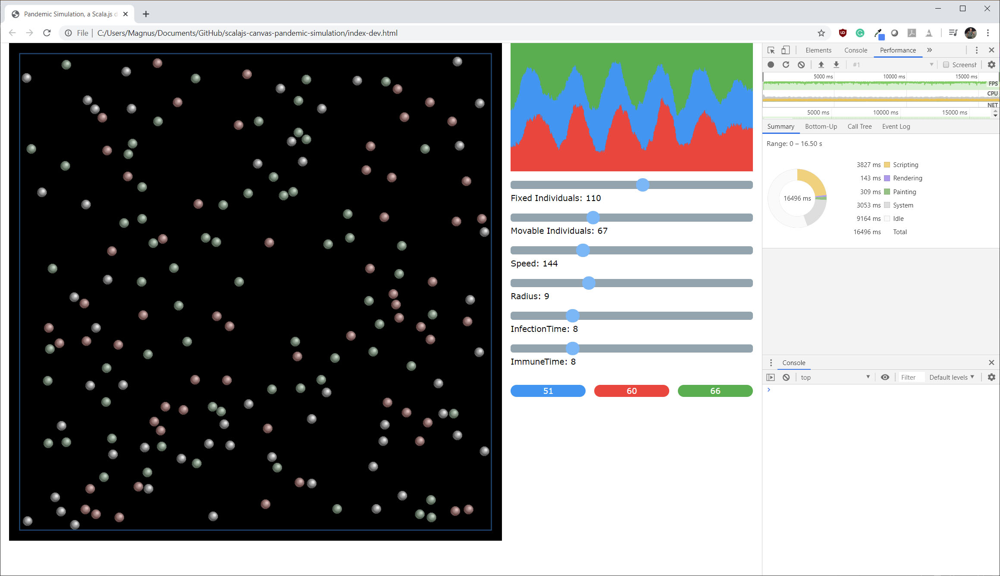

# Scala.js demo - Simulation of pandemic outbreak

[](https://travis-ci.org/badges/badgerbadgerbadger) 
[](http://badges.mit-license.org)

## Table of contents
* [General info](#general-info)
* [Technologies](#technologies)
* [Setup](#setup)
* [Run](#run)
* [Test](#test)
* [Screenshot](#screenshot)
* [License](#license)

## General info
The purpose of writing this demo was to learn how to use Scala.js to write front-end web applications for the web 
with Scala code. Since this has been done during the time of Covid-19 the application is a simple simulation of a 
pandemic outbreak with bouncing circles that spreads an infection and get immunity after some time. The starting 
conditions can easily be changed using sliders. 

#### Features
* 2D Physics library for moving and bouncing circles
* HTML document building with Scala.js
* HTML Canvas manipulation with scala.js
* Unit testing

#### Sources
Original layout from [@vmunier](https://github.com/vmunier/scalajs-simple-canvas-game)
	
## Technologies
Project is created with:
* [Scala](https://www.scala-lang.org) 2.13.1 
* [Scala.js](https://www.scala-js.org) 1.0.1 
* [utest](https://github.com/lihaoyi/utest) 0.7.4
* [w3.css](https://www.w3schools.com/w3css/)

## Setup
#### Install
* [sbt](https://www.scala-sbt.org)
* [node.js](https://nodejs.org/en)

#### node.js packages
##### jsdom 

is needed for DOM support for node.js
```
$ npm install jsdom
```
##### source-map-support
For resolving stack traces (debugging js)
```
$ npm install source-map-support
```
	
## Run
#### Developer mode
```
$ sbt fastOptJS
```
open index-dev.html in browser

#### Release mode
This will generate a much smaller JavaScript file that is more difficult to debug.
```
$ sbt fullOptJS
```
open index.html in browser

## Test
```
$ sbt test
```
## Screenshot
Screenshot when running in Chrome and profiling with the developer tools


## License
- **[MIT license](http://opensource.org/licenses/mit-license.php)**